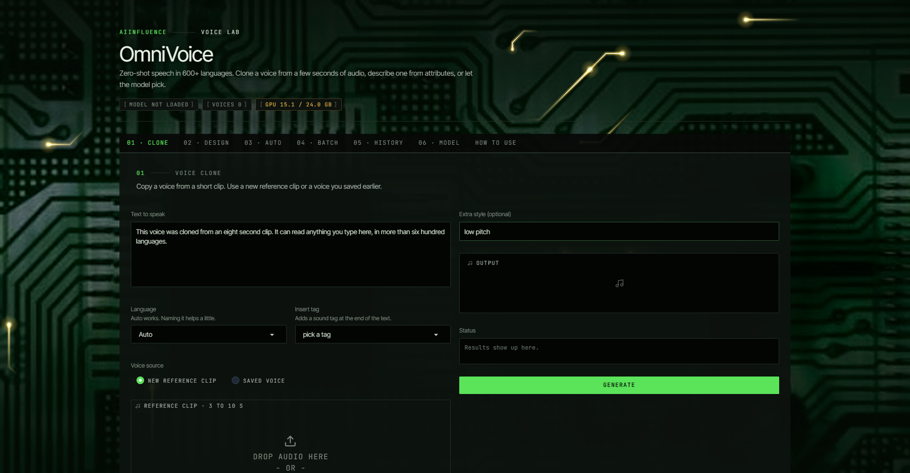
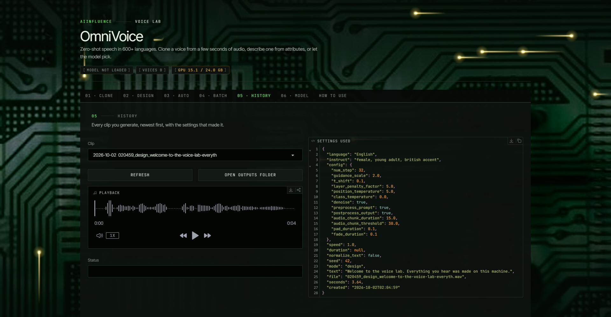

# AINF-OmniVoice

A local voice lab for [OmniVoice](https://github.com/k2-fsa/OmniVoice), the zero-shot TTS model from k2-fsa that speaks 600+ languages. You can clone a voice from a few seconds of audio, describe one with attributes, or let the model pick. Everything runs on your own GPU. Your text, clips and voices never leave the machine, and Gradio's usage analytics are switched off. The only downloads are the model weights on first run.



## Why I made this

The upstream demo works, but it's a bare test page. I wanted something I'd actually keep open while working: saved voices I can reuse, a history that tells me which seed and settings made a clip, batch generation for scripts, and one switch to free the GPU when I need it for training. It also had to look like it belongs next to the rest of the AIINFLUENCE tools, so it sits on a circuit board with current running along the traces into the chip.

## What's inside

| Tab | What it's for |
|---|---|
| 01 · Clone | Copy a voice from a 3 to 10 second clip (upload or record). Whisper fills in the transcript if you don't. Save the result as a named voice and skip the encoding next time. |
| 02 · Design | Build a voice from gender, age, pitch, whisper, English accent or Chinese dialect. A box shows the exact instruction the model gets. |
| 03 · Auto | The model picks a voice. Fix the seed to get the same one back. |
| 04 · Batch | One line of text becomes one clip, same voice for all of them, zipped at the end. |
| 05 · History | Every clip you've made, newest first, with the full settings and seed next to it. |
| 06 · Model | Checkpoint, precision, LoRA adapter, Whisper model. Load and unload from here. |

The generation settings live under the tabs and apply everywhere: steps, guidance, speed, exact duration, seed, temperatures, chunking for long text, and number spelling. A reset button puts them back to the upstream defaults.



## Install

Windows 10/11. An NVIDIA card is strongly recommended. It runs on CPU too, just slowly.

1. Download or clone this repo into a folder of your choice. Spaces in the path are fine.
2. Double-click `Setup OmniVoice.bat`.
3. Double-click `Start OmniVoice.bat`. The browser opens at http://127.0.0.1:7870.

The setup installs [uv](https://docs.astral.sh/uv/) if it's missing and downloads the OmniVoice source at the version this app was tested against. It then builds a Python 3.12 environment in `.venv`, installs PyTorch 2.8 (CUDA 12.8 when it finds an NVIDIA card, CPU otherwise) plus OmniVoice and Gradio, and asks whether to grab the model now (about 3.3 GB). Running it again repairs a broken install and leaves your outputs, voices and settings alone. Everything it does goes into `setup.log`.

| Setup flag | Effect |
|---|---|
| `/auto` | No questions, downloads the model |
| `/nomodel` | Skip the model download (it happens on first generate instead) |
| `/cpu` | Force the CPU build of PyTorch |

| Start flag | Effect |
|---|---|
| `--port 7870` | Change the port |
| `--listen` | Serve on your local network, not just this PC |
| `--preload` | Load the model at startup instead of on the first generate |

On an RTX 3090 the model takes about 7.5 GB of VRAM, and a short clip comes back in roughly 3 seconds at the default 32 steps.

## The board

The background is one canvas drawn by the browser, so it doesn't touch VRAM or slow generation. It holds 75 fps with the CPU throttled 4x, and if frames ever start dropping it cuts the pulse count and resolution on its own. `[FX ON]` in the footer turns the animation off and remembers that, and a system "reduce motion" setting turns it off by default.

The pulse paths come from the photo itself. `tools/trace_guided.py` starts at the chip's pins and the board edges, follows each copper trace outward and snaps it to 0, 45 and 90 degree routing. To swap in another board, save it as `assets/board-src.jpg`, set the chip box (`CHIP`) at the top of the script, and run:

```bash
uv run --no-project --python 3.12 --with scikit-image --with pillow --with scipy python tools/trace_guided.py
uv run --no-project --python 3.12 --with pillow --with scipy python tools/check_alignment.py
```

The second command reports how well the paths sit on the copper, with a shifted copy as a control.

## Where things go

| Path | Contents |
|---|---|
| `outputs/<date>/` | Every WAV you generate, with a JSON of its settings beside it |
| `voices/` | Saved voices, their reference clips and transcripts |
| `settings.json` | What you picked on the Model tab |
| `repo/` | OmniVoice source, installed by the setup |
| `.venv/` | The Python environment |

None of those are committed. Model weights sit in your Hugging Face cache, plus about 1.6 GB for Whisper the first time it transcribes something.

## Known limits

- The upstream text normalization package needs `pynini`, which doesn't build on Windows. Number spelling falls back to `num2words`, which covers whole numbers in many languages but not all of them. If yours isn't covered, write numbers out as words.
- Voice design was trained on English and Chinese. Other languages work but can wander.
- Cross-language cloning carries the reference speaker's accent. A Spanish clip reading English sounds Spanish, which is sometimes exactly what you want.

## Development

`dev/` holds the checks I ran while building this: `smoke_test.py` drives every generation path against the real model, `qa_ui.py` measures tab geometry at 1920x1080, `qa_board.py` checks frame rate and the FX toggle, `qa_e2e.py` clicks through the live app. The Playwright scripts expect a Python with Playwright and a local Chromium.

## Credits and use

Model and source: [k2-fsa/OmniVoice](https://github.com/k2-fsa/OmniVoice), Apache-2.0. Fonts: Inter Tight and JetBrains Mono, both SIL Open Font License.

Only clone voices you have permission to use. Don't use this for impersonation or anything meant to deceive people.

Built by AIINFLUENCE.
